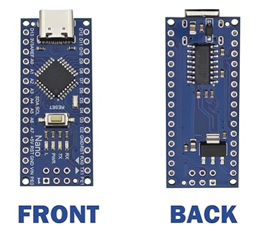
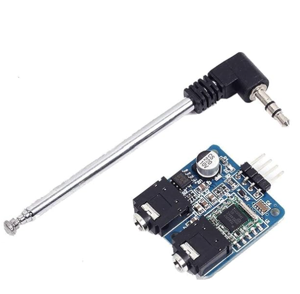
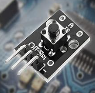
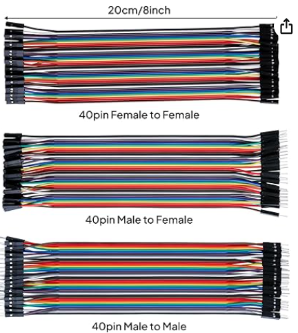
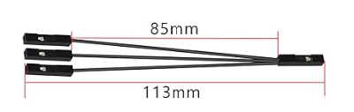
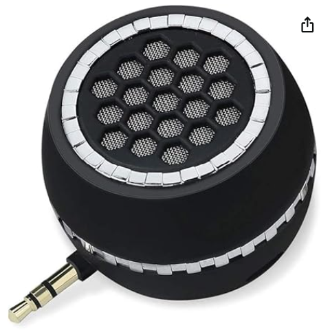
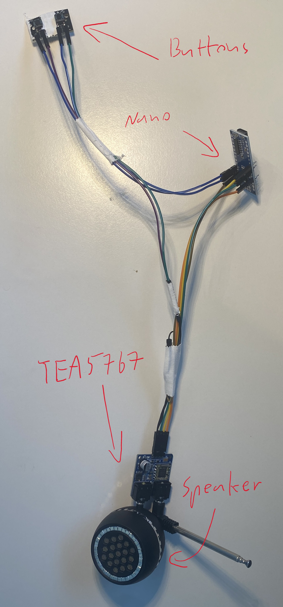

# DIY Arduino Mega Radio
A DIY radio based on Arduino Mega, controlled with buttons and LEDs for channel indication.

## ✨ Features

- DIY Arduino Mega radio
- Controlled via **buttons**
- **LEDs** indicate the current channel in a binary-like display
- **Potentiometer** to adjust the frequency
- **Precision mode** allows fine-tuning in 0.1 steps for exact frequency matching

## 🛠️ How the Arduino Nano radio is Built

### Step 1: Required Hardware

- **Arduino** & components:  

| Component | Image | Recommended Link |
|-----------|-------|-----------------|
| Arduino Nano |  | [Buy here](https://www.amazon.de/dp/B0CSZ4KB8W?ref=ppx_yo2ov_dt_b_fed_asin_title&th=1) |
| TEA5767 Radio Module |  | [Buy here](https://www.amazon.de/dp/B07VBVDNLL?ref=ppx_yo2ov_dt_b_fed_asin_title) |
| Buttons |  | [Buy here](https://www.amazon.de/dp/B07ZTQZP9G?ref=ppx_yo2ov_dt_b_fed_asin_title) |
| Jumper Wires |  | [Buy here](https://www.amazon.de/dp/B01EV70C78?ref=ppx_yo2ov_dt_b_fed_asin_title) |
| 1-to-3 Splitter Wires |  | [Buy here](https://www.amazon.de/dp/B0FLJFHBJ9?ref=ppx_yo2ov_dt_b_fed_asin_title) |
| Speaker |  | [Buy here](https://www.amazon.de/dp/B089YMTR6L?ref=ppx_yo2ov_dt_b_fed_asin_title&th=1) |

### Step 2: Assemble Arduino Nano & Install Drivers / FM Module Library

1. First, connect the ports Nano -- TEA5767:

- **GND (Arduino Nano) → Splitter Wire → TEA5767**
- **5V (Arduino Nano) → 5V (TEA5767)**
- **SDA (TEA5767) → A4 (Arduino Nano)**
- **SCL (TEA5767) → A5 (Arduino Nano)**

2. Nano -- 2 Buttons:
- **GND (Splitter Wire) → GND Button (- Pin)**
- ** D2 & D3 Nano → Button (S Pin)**



### Step 3: Install Arduino Drivers & Import FM Module Library

1. **Install Arduino Drivers**  
   Download the driver here: [CH340 Driver for Windows 8+](https://www.arduined.eu/ch340-windows-8-driver-download/)  
   > Copy & paste this link in your browser to download.  
   > For other operating systems (Mac, older Windows), check the product description here: [Arduino Nano on Amazon](https://www.amazon.de/dp/B0CSZ4KB8W?ref=ppx_yo2ov_dt_b_fed_asin_title&th=1)

2. **Import the TEA5767 FM Module Library**  
   - Download the ZIP library from this GitHub repository: [TEA5767 Library on GitHub](https://github.com/big12boy/TEA5767)  
   - Then in Arduino IDE → *Sketch* → *Include Library* → *Add .ZIP Library* → Select the downloaded ZIP.  
   - Alternatively, if you have Git installed, you can clone the library directly:  
   ```bash
   git clone https://github.com/big12boy/TEA5767.git

### Step 4:
1. **Plug your Nano into your PC**
2. **Open the .ino script**
3. **Select your board and COM port**  
   - In Arduino IDE: *Tools → Board → Arduino Nano*  
   - Then *Tools → Port → Select the COM port corresponding to your Nano*
4. **Upload the script to your Nano**  
   - Press **Ctrl + R** to verify/compile the code  
   - Press **Ctrl + U** to upload it to the Nano


